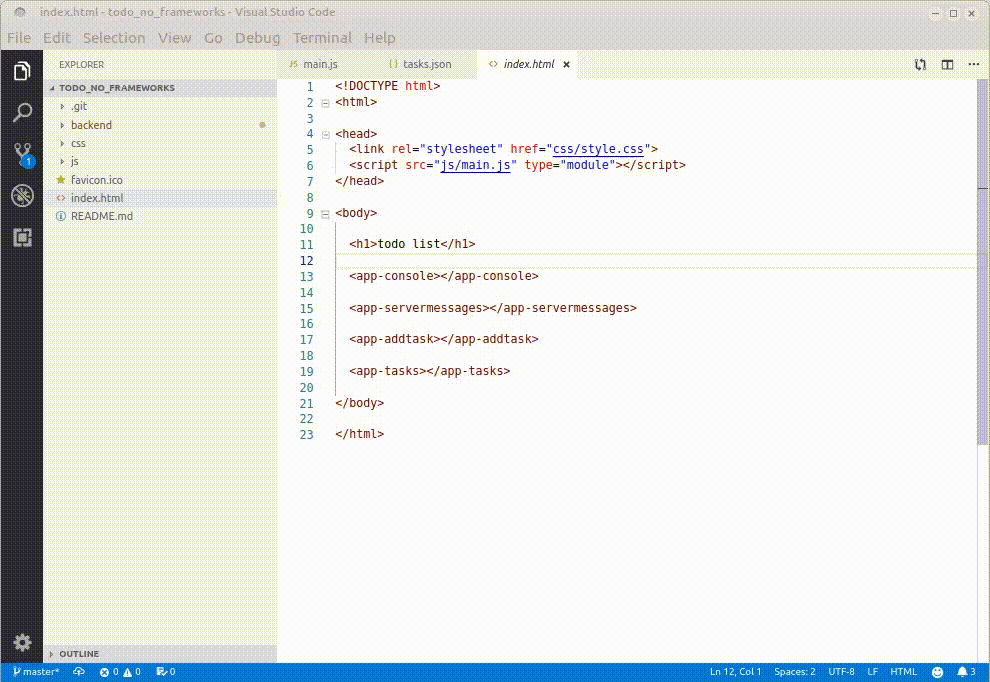

# TODO list with simple pubsub, async server communication and no frameworks

 

[#noframeworks](https://dev.to/gypsydave5/why-you-shouldnt-use-a-web-framework-3g24), just plain JavaScript ES6 with a simple php backend.

It uses built-in ES6 webcomponents and the pubsub pattern to allow each component to subscribe and/or publish to the datastore. In 399 lines of Javascript. Including an evil boss who keeps adding pointless meetings. And a 'slow' server to demo the async-ness of it all.



## caveats
I used a plain JSON file as a 'database' just to demonstrate proof-of-concept. As JSON is a data-interchange format it's obviously not the tool for reliable client/server data sync but most (all?) of these problems would be solved with a proper db backend.

## install

This was built on
* php 7.3
* chromium 74
* Ubuntu 18.04

The only real requirements are php 7.x and avoid using non-chromium IE/Edge

To install,
* download and unzip to a folder of your choice
* start with `php -S localhost:4567`
* point your browser at `localhost:4567`

## how it works

Objects that have something to say publish a string of NewInfo and an object of data:
```
    let task = {
      taskname: document.querySelector('#taskname').value,
      message: 'client added ' + document.querySelector('#taskname').value,
      changeTask: false,
      deleteTask: false,
      checked: false,
      css: 'closed'
    };
    this.pubsub.publish('AddTask', task);
```
Objects that are interested in those news items subscribe to 'NewPerson'/'Message'/'SomeEvent' etc, state what info they want and give the callback function they want to be fired:
```
	this.pubsub.subscribe('AddTask', 'getMeta', this.renderData);
```
I could have wrapped all requests in an object, so instead of 
<pre>
this.pubsub.subscribe(<b>'AddTask'</b>, 'getMeta', this.renderData);
this.pubsub.subscribe(<b>'ChangeTask'</b>, 'getMeta', this.renderData);
this.pubsub.subscribe(<b>'DeleteTask'</b>, 'getMeta', this.renderData);
	this.pubsub.subscribe(<b>'ServerTask'</b>, 'getMeta', this.renderData);
</pre>
we would have
<pre>
	this.pubsub.subscribe(<b>{'AddTask', 'ChangeTask','DeleteTask','ServerTask'}</b>, 'getMeta', this.renderData);
</pre>
but then it would be more tricky to assign specific requests/callbacks to each NewInfo.

## structure
```
Language            Files        Lines         Code     Comments       Blanks
-------------------------------------------------------------------------------
 CSS                     1          105           86            1           18
 HTML                    1           23           14            0            9
 JavaScript             13          562          399           87           76
 Markdown                1          115          115            0            0
 PHP                     6          258          145           82           31
-------------------------------------------------------------------------------
 Total                  22         1063          759          170          134

├── backend
│   ├── debug.log
│   ├── evilBoss.php
│   ├── receiveTask.php
│   ├── sendTasks.php
│   └── tasks.json
├── css
│   └── style.css
├── favicon.ico
├── index.html
├── js
│   ├── components
│   │   ├── app-addtask.js
│   │   ├── app-console.js
│   │   ├── app-servermessages.js
│   │   ├── app-task.js
│   │   └── app-tasks.js
│   ├── data
│   │   ├── datastore.js
│   │   ├── fetchTasks.js
│   │   ├── pubsub.js
│   │   └── sendTask.js
│   ├── helpers
│   │   ├── app-rootelement.js
│   │   ├── generateRandomTask.js
│   │   └── serverMonitor.js
│   └── main.js
└── README.md
 ```

## notes
I used [James Johnson's](http://jelly.codes/articles/javascript-es6-autobind-class/) code to autobind 'this' for methods instead of having to do it in every class. So originally I had something like:
<pre>class appAddtask extends HTMLElement {}</pre>
I now have:
<pre>class appAddtask extends RootElement {}</pre>
and RootElement extends HTMLElement.

It needed a couple of changes:
* [currCls.\_\_proto\_\_](https://developer.mozilla.org/en-US/docs/Web/JavaScript/Reference/Global_Objects/Object/proto) is deprecated in favor of [Object.getPrototypeOf(currCls)](https://developer.mozilla.org/en-US/docs/Web/JavaScript/Reference/Global_Objects/Object/getPrototypeOf)
* Object.getPrototypeOf(currCls) needs to be checked for null/undefined, hence the check on line 16 in app-rootelement.js

The [Vaadin](https://www.youtube.com/channel/UCsGakFIbOsj-fgPFLf1QlQA) clip that showed me the way is [here](https://www.youtube.com/watch?v=mTNdTcwK3MM&t=213s)

Use as you like, ask questions if stuck, and stars are nice (top right)...
