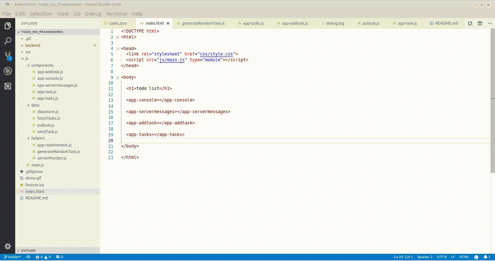

# TODO list with simple pubsub, asyncronous server updates and no frameworks

 

[#noframeworks](https://dev.to/gypsydave5/why-you-shouldnt-use-a-web-framework-3g24), just pure JavaScript ES6.

It uses built-in ES6 webcomponents and the pubsub pattern to allow each component to subscribe and/or publish to the datastore. In 300 lines of pure Javascript.

## Install

## how it works

##

I used [James Johnson's](http://jelly.codes/articles/javascript-es6-autobind-class/) code to autobind 'this' for methods instead of having to do it in every class. So originally I had something like:
<pre>class appAddtask extends HTMLElement {}</pre>
I now have:
<pre>class appAddtask extends RootElement {}</pre>
and RootElement (with James' code) extends HTMLElement.

It did need a couple of changes:
* [currCls.\_\_proto\_\_](https://developer.mozilla.org/en-US/docs/Web/JavaScript/Reference/Global_Objects/Object/proto) is deprecated in favor of [Object.getPrototypeOf(currCls)](https://developer.mozilla.org/en-US/docs/Web/JavaScript/Reference/Global_Objects/Object/getPrototypeOf)
* Object.getPrototypeOf(currCls) needs to be checked for null/undefined, hence the check on line 16 in app-rootelement.js

The [Vaadin](https://www.youtube.com/channel/UCsGakFIbOsj-fgPFLf1QlQA) clip that showed me the way is [here](https://www.youtube.com/watch?v=mTNdTcwK3MM&t=213s)

Use as you like, ask questions if stuck, and stars are nice (top right)...